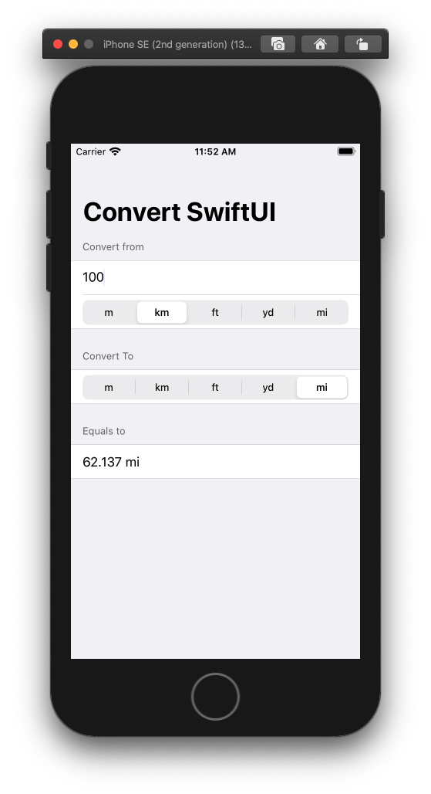

# UnitConvertSU

Small iOS app built using SwiftUI to convert units. Main purpose of the app is to demonstrate how SwiftUI's views are a function of their state. And for me to learn using them.

## Screenshot

